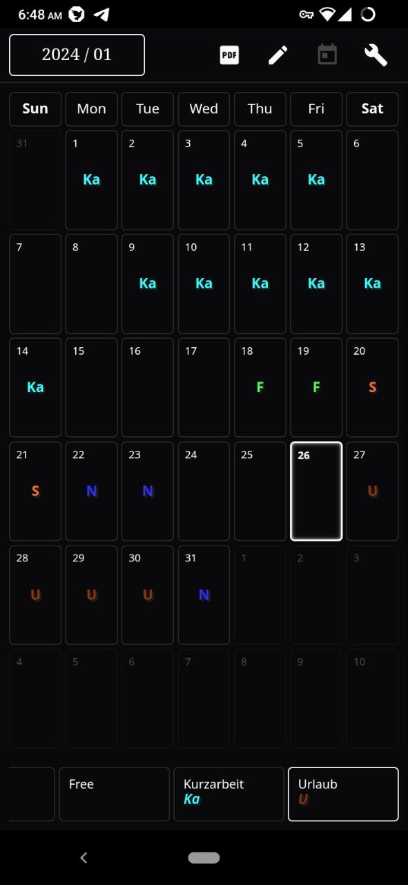
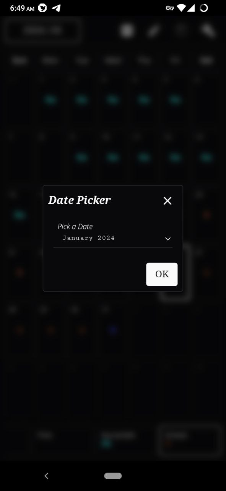
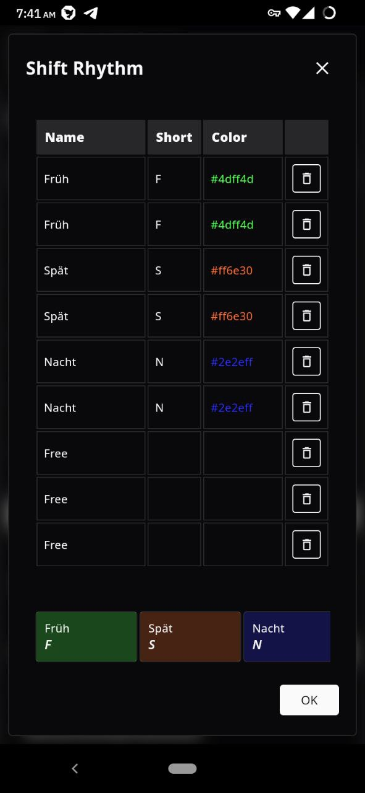
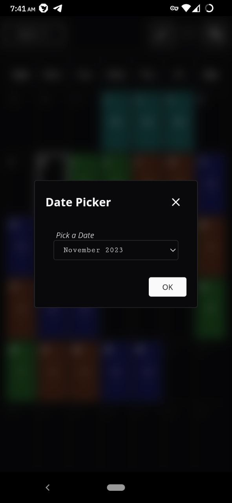
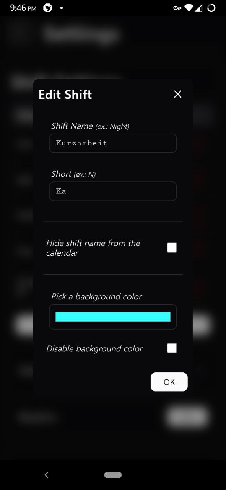
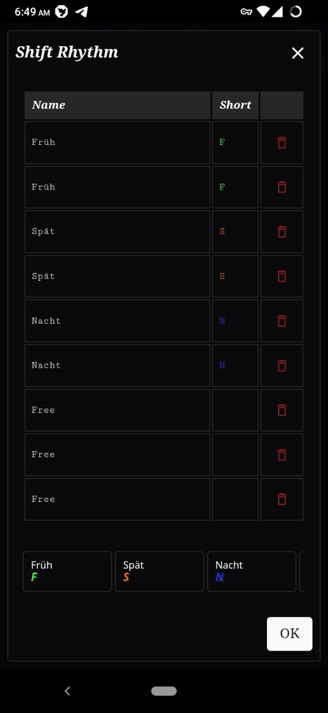

# Svelte Shift Scheduler


[](https://github.com/knackwurstking/svelte-shift-scheduler/releases)

A simple shift scheduler. (enables rhythm configuration)

- Adding shifts, a rhythm and a start date.
- This app uses the browsers `localStorage` for now.
- Adding notes per day.
- Languages: de, en-US

## Gettings Started

Download

```bash
git clone https://github.com/knackwurstking/svelte-shift-scheduler.git
cd svelte-shift-scheduler
npm install
```

Run dev server

```bash
npm run dev
```

Build Android app

```bash
export CAPACITOR_ANDROID_STUDIO_PATH=$(which android-studio)
npm run build:android
```

Build macos app

```bash
...
```

## Screenshots








